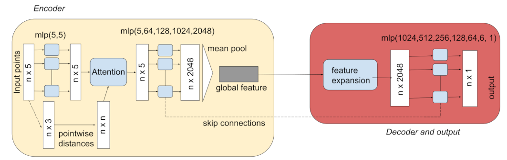

## THE CODE OF THIS REPO IS PRIVATE

# 🧪 Reaction–Diffusion Surrogate Model (InterpretTME)

This project focuses on learning a **fast surrogate model** for solving a **reaction–diffusion PDE** arising in cytokine signaling, replacing expensive FEM simulations with a neural network.

---

## 🚀 Overview

We aim to approximate the solution of a **quasi-steady-state reaction–diffusion equation**:

$$
D \Delta c(x) - \eta c(x) = 0 \quad \text{in } \Omega
$$

Where:

- `c(x)` = cytokine concentration  
- `D` = diffusion coefficient  
- `η` = decay rate  
- `Ω ⊂ ℝ³` = extracellular domain  

The domain contains **cells** acting as sources or sinks.

---

## 🧩 Boundary Conditions

We distinguish between two types of cells:

- **Secreting cells** $\Gamma_{i,\text{sec}}$
- **Absorbing cells** $\Gamma_{i,\text{abs}}$

Secreting cells:

$$
-D \frac{\partial c}{\partial n} = -q_{\text{eff}} \quad \text{on } \Gamma_{i,\text{sec}}
$$

Absorbing cells:

$$
-D \frac{\partial c}{\partial n} = \psi(c) \quad \text{on } \Gamma_{i,\text{abs}}
$$

Outer boundary:

$$
\frac{\partial c}{\partial n} = 0 \quad \text{on } \partial \Omega
$$

### Uptake Function

$$
\psi(c, R) = \frac{k_{\text{endo}} \cdot R \cdot c}{\frac{k_{\text{off}}}{k_{\text{on}}} + c}
$$

- `R` = receptor count per cell

---

## 📊 Dataset

Each training sample consists of **N = 50 cells**, stored as:

Each training sample consists of **N = 50 cells**, stored as:

```python
shape = (6, N)
```

| Channel | Description                         |
| ------- | ----------------------------------- |
| 1-3     | Cell center coordinates (x, y, z)   |
| 4       | Cell type (secreting / absorbing)   |
| 5       | Receptor count (normalized)         |
| 6       | Target: avg. cytokine concentration |

---

### Data Augmentation

```python
augmentations = [
    "axis reflections (x, y, z)",
    "rotations by multiples of pi/2"
]
```

---

## Model Architecture
## 🔍 Key Modifications to PointNet

- Mean pooling instead of max pooling  
- Skip connections across bottleneck  
- Attention mechanism based on pairwise distances  
- Permutation invariance preserved

### Attention Mechanism

```math
\text{softmax}(-\|x_i - x_j\|^2)
```

models inverse-square distribution of cytokine concentration.
Autoencoder encodes the $\frac{n(n-1)}{2}$ pairwise distances into latent, rotation-invariant latent space of dim. $3N - 6$ before input.



### Results

Achieves a loss ~1e-3 on complex cytokine distributions of $50$ interacting cells.
